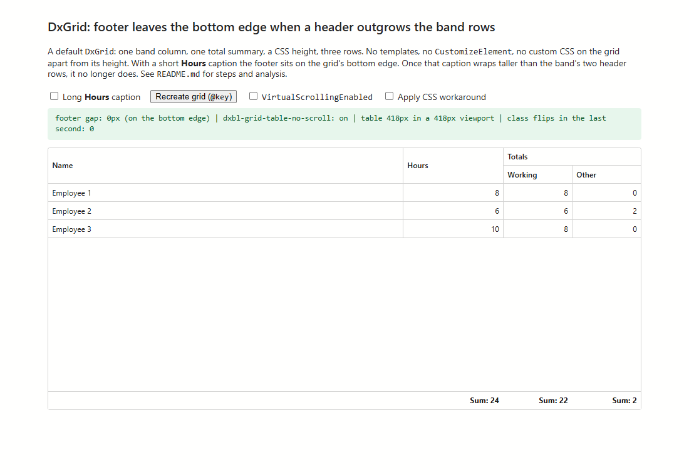
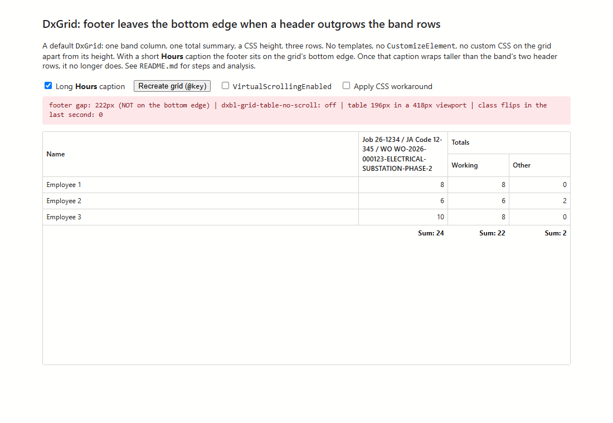
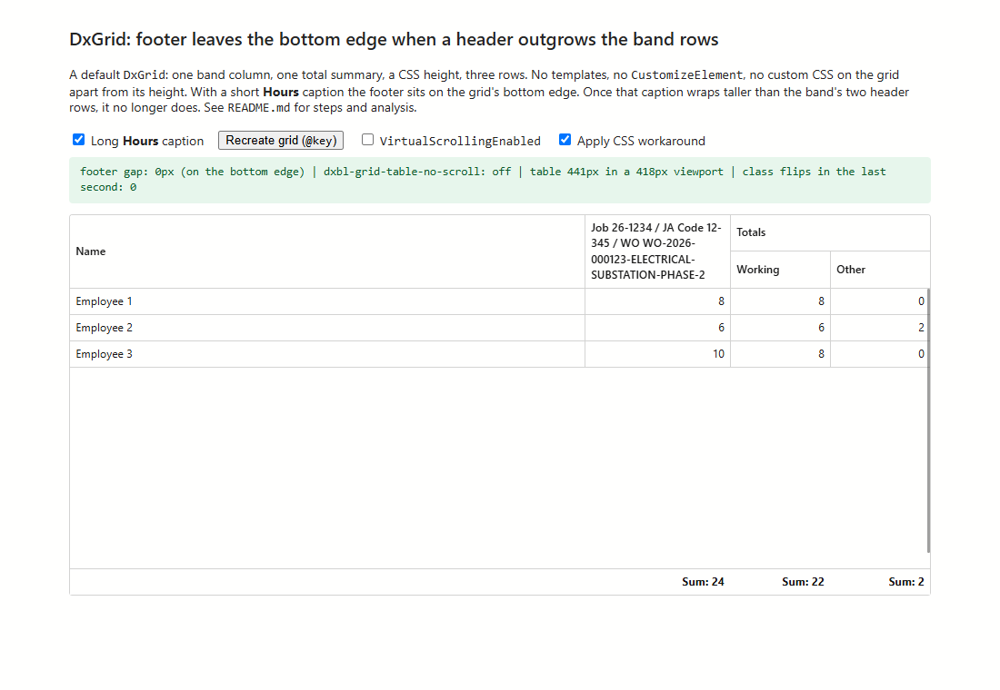

# DxGrid: footer leaves the bottom edge when a header is taller than the band header rows

Minimal reproduction for DevExpress Blazor `DxGrid` **26.1.3**.

## Summary

When a `DxGrid` with a fixed height has fewer rows than fit, the total-summary footer sits on the grid's bottom edge.
That breaks when the grid has a band column and an ordinary (non-band) column's header wraps taller than the band's
two header rows. In that case the footer is drawn directly under the last data row, leaving empty space below it. The
DevExpress class that controls this layout can also toggle on and off continuously.

The grid is a default configuration: one band column, one total summary, a CSS height and three rows. It uses no
templates, no `CustomizeElement`, and no custom CSS on the grid other than its height. The wrapping comes from the
default `TextWrapEnabled`.

## Environment

- DevExpress.Blazor 26.1.3, Fluent theme
- .NET 10, Blazor Web App, Interactive Server render mode
- Microsoft Edge 154 (Chromium)
- Firefox not tested; DevExpress applies different filler-row rules there.
- `VirtualScrollingEnabled` on or off makes no difference.

## Run

```
dotnet run --launch-profile http
```

Open http://localhost:5291. Restoring requires access to the DevExpress NuGet feed.

## Steps to reproduce

1. Open http://localhost:5291. The **Hours** caption is short and the footer sits on the bottom edge (screenshot 1).
2. Open http://localhost:5291/?long=true. The **Hours** caption now wraps to four lines, taller than the
   **Totals** band's two header rows. The footer is directly under the last row, 222px above the bottom edge
   (screenshot 2).
   - To do the same interactively, tick **Long Hours caption**, then click **Recreate grid (@key)**.
3. Reload http://localhost:5291 and only tick **Long Hours caption**, changing the caption on the existing grid.
   The footer stays down, but the grid becomes scrollable by about 23px even though all rows fit.

**Expected:** the footer stays on the bottom edge in every case, as it does with the short caption, and the grid does
not scroll when its rows fit.

The diagnostics line above the grid is read-only (`wwwroot/footer-diagnostics.js`). It shows:
- the footer's distance from the bottom edge;
- whether the table has `dxbl-grid-table-no-scroll`;
- the table height compared with the scroll viewer height;
- how often that class flipped in the last second.

| 1. Short caption (expected) | 2. Long caption (bug) |
| --- | --- |
|  |  |

## Analysis

- **The filler row:** when rows don't fill the grid, a filler row (`tr.dxbl-grid-empty-row`, always rendered by
  `GridMainTableRows`) pushes the footer to the bottom. That row is only displayed while the table has
  `dxbl-grid-table-no-scroll`, which gives the table and the filler `height: 100%`.
- **The class is set only by JavaScript:** `onScrollViewerUpdate` in `dx-blazor-all.js` adds it when
  `table.offsetHeight < scrollViewerContent.clientHeight` and removes it when the table is taller.
- **The overshoot:** when an ordinary column's header spans the band's header rows and is taller than they are,
  Chromium lays out the tagged table taller than the viewport. In this repro it is 441px in a 418px viewport, an excess
  equal to the header's extra height.
- **The toggle:** with the class on, the table is too tall and the class is removed. With it off, the table is too
  short and the class is added back. The outcome depends on timing:
  - it settles **off**, and the footer floats (step 2);
  - it stays **on**, with a stray scroll range (step 3);
  - or it flips continuously. This repro measured up to about 145 flips per second on first load with virtual
    scrolling, and the flipping is continuous in our production grid.

## Workaround

Tick **Apply CSS workaround** (screenshot 3). The rules at the end of `wwwroot/app.css` apply the no-scroll layout
unconditionally, so the footer no longer depends on the measured class. A table's height is only a minimum: a short
grid stretches to the viewport, and a long grid still grows and scrolls under the sticky footer. The remaining side
effect is that a grid with a tall header still scrolls by the overshoot, with the footer pinned.



## Files

- `Components/Pages/Home.razor`: the grid and the toggles
- `wwwroot/app.css`: the grid height and the optional workaround
- `wwwroot/footer-diagnostics.js`: read-only diagnostics
